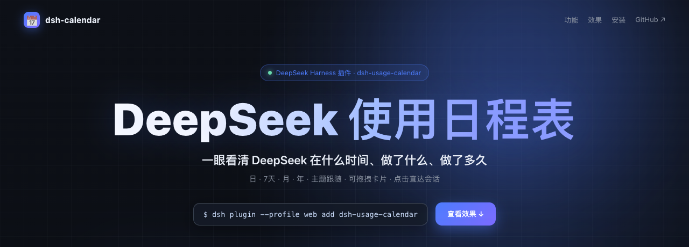
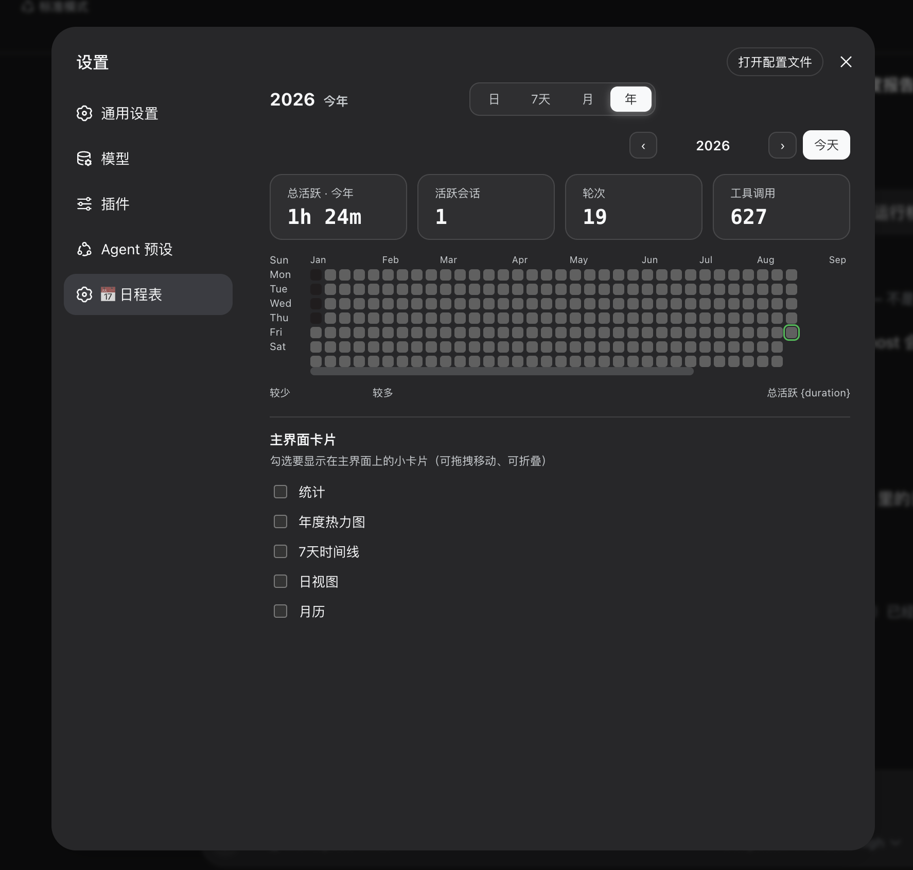
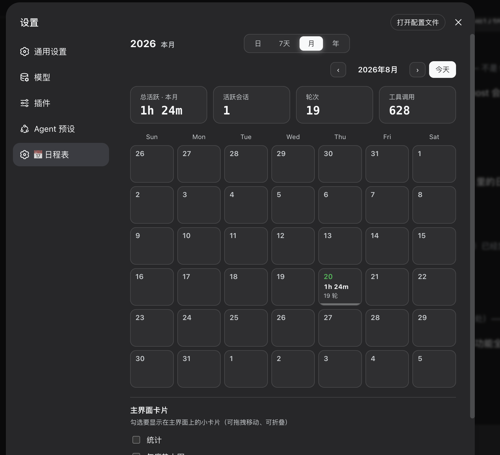
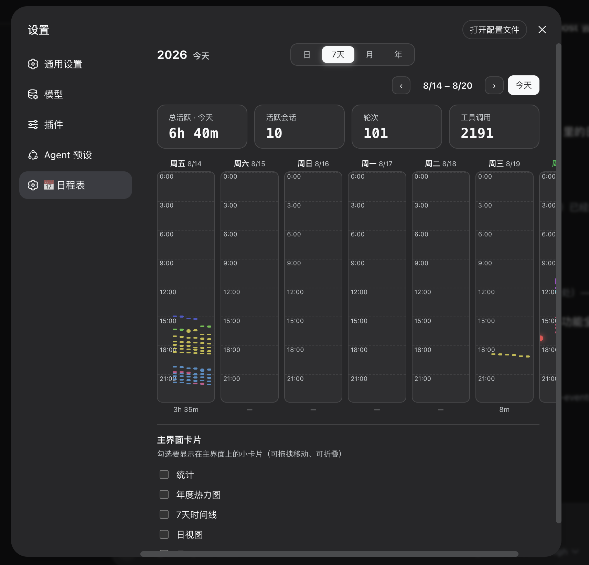
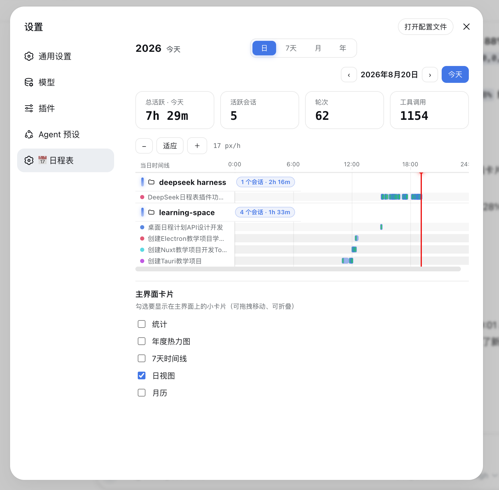
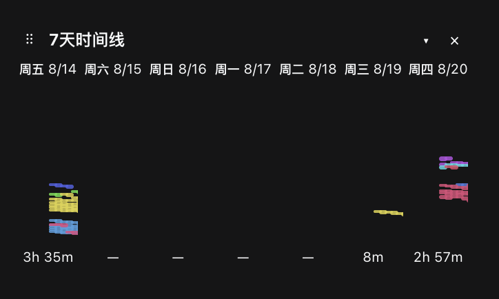
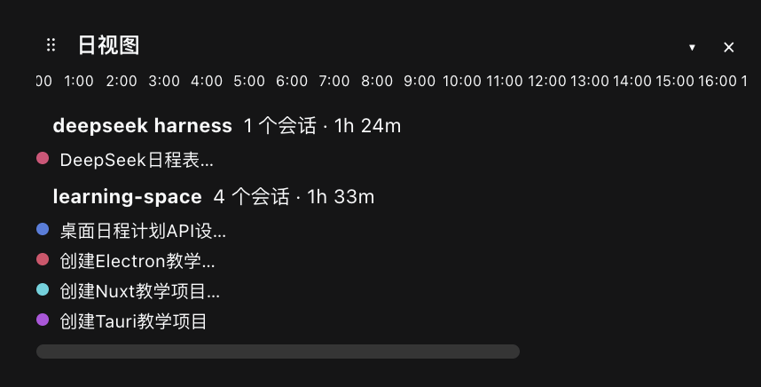

# 📅 dsh-calendar

> **See at a glance what DeepSeek did, and when.** A beautiful, theme-aware usage calendar for [DeepSeek Harness](https://github.com/deepseek-ai/deepseek-harness) — every project and task's execution time, in **day / 7-day / month / year** views.

English | [中文](README.zh.md)

[](https://www.npmjs.com/package/dsh-usage-calendar) [](LICENSE)



---

## Screenshots

Four time perspectives of your DeepSeek usage — light and dark both follow DSH.

<table align="center">
  <tr>
    <td align="center"><br/><b>🗓️ Year</b></td>
    <td align="center"><br/><b>🗂️ Month</b></td>
    <td align="center"><br/><b>📅 7-day</b></td>
    <td align="center"><br/><b>⏱️ Day</b></td>
  </tr>
</table>

<table align="center">
  <tr>
    <td align="center"><br/><b>🃏 Main-UI card · 7-day</b></td>
    <td align="center"><br/><b>🃏 Main-UI card · Day</b></td>
  </tr>
</table>

---

## Why

You use DeepSeek Harness every day — dozens of sessions, background jobs, scheduled reminders. But there was never a way to *see* the work: when each project ran, for how long, how much tool activity happened, or when the next recurring task fires.

`dsh-calendar` turns your existing usage history into a beautiful calendar — **zero configuration, no extra data store, nothing to maintain.** Install, restart, open **Settings → 📅 Calendar**, and your entire history is there.

## Features

| | |
|---|---|
| 🗓️ **Year heatmap** | GitHub-style 52×7 contribution map — spot your busiest seasons at a glance |
| 📅 **7-day timeline** | Seven columns, one day each, a vertical 24-hour timeline. Every session keeps its own color, so you can trace one task across days |
| ⏱️ **Day timeline** | 24-hour Gantt axis by workspace → session. Turns merge into **task segments** — one user prompt opens a task, the work that follows joins it, one bar per task |
| 🗂️ **Month grid** | Classic calendar with per-day heat bars and totals |
| 🃏 **Main-UI cards** | Draggable mini cards (stats / year / 7-day / day / month) float over the main interface — move, collapse, or close them; pick which ones show in Settings |
| 🖱️ **Drill through** | Click any timeline bar to **open the actual conversation** |
| 📊 **Stats strip** | Active time / sessions / turns / tool calls for the selected range, with count-up numbers |
| 🎨 **Theme-aware** | Follows the harness theme — light and dark, automatically |
| ✨ **Animations** | Gentle entry effects and a decrypt-reveal headline — nothing janky, nothing in the way |
| 🕐 **History, out of the box** | Past sessions are folded and cached at startup — last month's activity is visible without opening anything |

## Install

```sh
dsh plugin --profile web add dsh-usage-calendar
```

Restart `dsh web`, then open **Settings → 📅 Calendar**.

## Usage

- **Views** — switch Day / 7-day / Month / Year with one click; `‹ ›` steps, **Today** jumps back.
- **Drill through** — click a heatmap cell, a month cell, or a timeline bar to jump into that day or conversation.
- **Main-UI cards** — drag the ⠿ handle anywhere, collapse `▾`, close `×`; re-enable in Settings → Calendar → Main-UI cards.
- **Hover** — any cell or bar shows the exact window, duration, and turn count.
- **Live** — running sessions pulse, and today's day view draws a live now-line.

## Demo preview

▶️ **Live demo:** [open the showcase page](https://htmlpreview.github.io/?https://raw.githubusercontent.com/YLifeOnlyOnce/dsh-calendar/main/docs/showcase.html) — hero banner, four views, and the main-UI cards, ready to screenshot.

No live harness needed to preview the visuals locally either — the repo ships a demo page with rich sample data (dark/light switchable):

```sh
pnpm demo:build && open docs/demo.html
```

## Roadmap

- **Recurring-reminder panel** (upcoming / overdue / fired history) with ⏰ markers on the timelines
- **Yearly `Wrapped` report** + shareable PNG export
- Workspace filtering and session search
- iCal export of DeepSeek's active windows

## License

[MIT](LICENSE)
