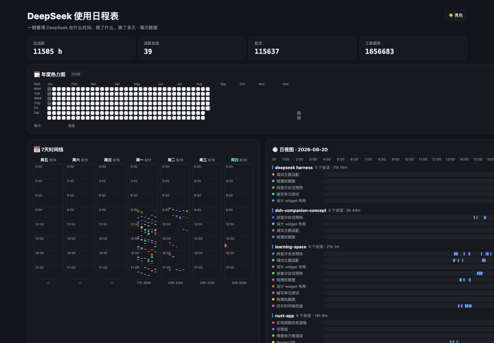
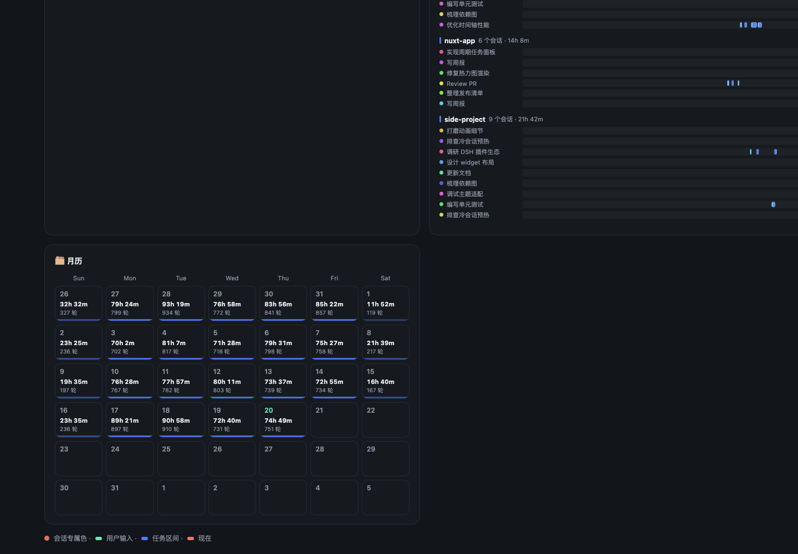
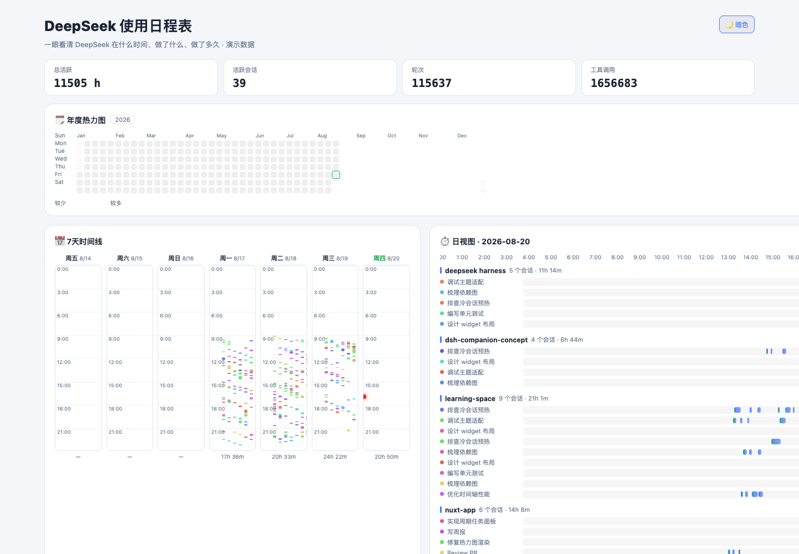

# 📅 dsh-calendar

> **See at a glance what DeepSeek did, and when.** A beautiful, theme-aware usage calendar for [DeepSeek Harness](https://github.com/deepseek-ai/deepseek-harness) — every project and task's execution time, in **day / 7-day / month / year** views.

English | [中文](README.zh.md)

[](https://www.npmjs.com/package/dsh-usage-calendar) [](LICENSE)

---

## Screenshots

**年度热力图 · 7天时间线 · 日视图 Gantt · 月历**（演示数据，亮/暗主题自动跟随 DSH）







## Why

You use DeepSeek Harness every day — dozens of sessions, background jobs, scheduled reminders. But there was never a way to *see* the work: when each project ran, for how long, how much tool activity happened, or when the next recurring task fires.

`dsh-calendar` folds the harness's **durable session logs** into a beautiful calendar. Open **Settings → 📅 Calendar** and your entire usage history is there — zero configuration, no extra data store, nothing to maintain.

## Features

| | |
|---|---|
| 🗓️ **Year heatmap** | GitHub-style 52×7 contribution map of active time — cells grow in column by column |
| 📅 **7-day timeline** | Seven columns, one day each, a vertical 24-hour timeline. Every session keeps its own color, so you can trace one task across days |
| ⏱️ **Day timeline** | A 24-hour Gantt axis grouped by workspace → session. Turn spans merge into **task segments** (a user prompt opens one; turns within 5 minutes join it) with a pulsing red **now** line |
| 🗂️ **Month grid** | Classic calendar with per-day heat bars and totals |
| 🃏 **Main-UI cards** | Small draggable cards (stats / year / 7-day / day / month) float over the main interface — move them anywhere, collapse or close them; choose which ones show in Settings |
| 📊 **Stats strip** | Range-scoped active time / sessions / turns / tool calls, with decrypt-reveal headlines and count-up numbers |
| 🖱️ **Drill through** | Click any timeline bar to **open the actual conversation** |
| 🎨 **Theme-aware** | Every color resolves through the harness ui-theme tokens — light *and* dark mode follow automatically |
| ✨ **Animations** | [anime.js](https://animejs.com) entry effects + a hand-rolled decrypt-reveal headline (in the spirit of [canvas-ui's DecryptReveal](https://github.com/DavidHDev/canvas-ui)) |
| 🕐 **History, out of the box** | Cold persisted sessions are folded and cached at startup — last month's activity is visible without opening a single session |

## Try it — demo preview

No live harness needed to see the visuals: the repo ships a standalone demo page with a rich synthetic dataset (dark/light switchable).

```sh
pnpm demo:build     # builds lib/demo.js
# then open docs/demo.html (or serve the repo root, e.g. python3 -m http.server)
```

## Install & Enable

Requires DeepSeek Harness with the Web profile (aligned with `0.1.0-rc.7`).

```sh
dsh plugin --profile web add dsh-usage-calendar
```

Restart `dsh web`, then open **Settings → 📅 Calendar**.

> The plugin is a **bundle layer**: it joins the web profile's `dsh.profile.bundles`, applies its `cordis.patch.yml` overlay, and its browser half is discovered automatically via the `dsh.client` manifest — no manual wiring.

## Usage

- **Views** — switch Day / 7-day / Month / Year with the segmented control.
- **Navigation** — `‹ ›` steps by the view's unit; **Today** jumps back; clicking a heatmap or month cell drills into that day.
- **Drill through** — click a timeline bar to open its conversation.
- **Main-UI cards** — drag by the ⠿ handle, collapse `▾`, close `×`; re-enable in Settings → Calendar → Main-UI cards.
- **Hover** — any cell or bar shows the exact window, duration, and turn count.
- **Live** — running sessions pulse, and today's day view draws a live now-line.

## How it works

Zero new infrastructure: the plugin reuses the harness's **session-projection seam** (the same mechanism behind the official `session-stats`).

```
Session event logs (turn/start→end, tool/call→result, user/message, schedule/change, …)
        │  session/event
        ▼
Host plugin · calendar projection unit (pure fold, plain-JSON state)
        │  sessionProjections → session/projection frames + list rows
        ▼
Browser plugin · aggregates `useSessions()` rows → day buckets, task segments, heatmaps
```

- **Active time** = wall-clock spans of closed turns, attributed to local calendar days with midnight splits (DST-safe). Tools run inside turns, so summing them separately would double-count.
- **Task segments** = a user prompt opens one; following turns join it while gaps stay under 5 minutes — one bar per task on the timelines.
- **Per-session wire value** is compact and bounded: ≤ 400 daily buckets, ≤ 1000 recent intervals, a 24-hour activity profile, and the recurring-reminder plan + dispatch history.
- **Cold warm-up**: startup folds every persisted session via the projection cache's `coldSnapshot` and writes checkpoints back — history shows immediately.
- **Recurring reminders** are folded from the `schedule/change` event stream — the calendar shows next targets and fired history.
- **Whole-log scope** matches `session-stats`: a fork child includes its inherited parent history (documented boundary).

## Configuration

Override in your profile's `cordis.patch.yml`:

```yaml
- id: calendar
  config:
    keepDays: 400        # per-session day buckets retained (year view needs ~400)
    intervalCap: 1000    # recent activity intervals per session (day/week view precision)
    hourProfileDays: 30  # days feeding the 24-hour activity profile
```

## Development

```sh
pnpm install
pnpm typecheck          # strict TypeScript
pnpm test               # 33 unit tests (fold semantics, segments, bounds, schedules)
pnpm build              # host ESM + browser module-loader bundle
pnpm demo:build         # standalone demo page (docs/demo.html)
pnpm verify:sessions    # fold your real ~/.dsh/sessions logs into a terminal report
```

```
packages layout:
  src/
    index.ts        # host plugin: registers the projection unit + cold warm-up
    activity.ts     # event → daily buckets / intervals / hourly profile fold
    schedules.ts    # schedule/change → reminders plan + dispatch history fold
    projection.ts   # the `calendar` ProjectionDefinition (zod-validated wire value)
    warmup.ts       # cold-session projection warm-up via the cache's coldSnapshot
    config.ts       # schemastery Config
    types.ts        # shared wire types + event/projection declaration merges
    client/
      index.ts          # browser plugin: settings page + main-UI cards + stylesheet
      CalendarSection.tsx  # settings page: view switcher, nav, stats
      CardOverlay.tsx     # main-UI floating cards (shell.overlay)
      YearView / WeekView / MonthView / DayView
      useCalendarData.ts  # useSessions aggregation, task-segment merge, quantiles
      decrypt.tsx         # decrypt-reveal text animation
      calendar.css.ts     # theme-token stylesheet
      demo.tsx            # demo page (mock data, `pnpm demo:build`)
```

## Roadmap

- **Recurring-reminder panel** (upcoming / overdue / fired history) and ⏰ markers on the timelines
- **`dsh-wrapped` style yearly report** + shareable PNG export
- Workspace filtering and session search inside the calendar
- iCal export of DeepSeek's active windows

## License

[MIT](LICENSE)
